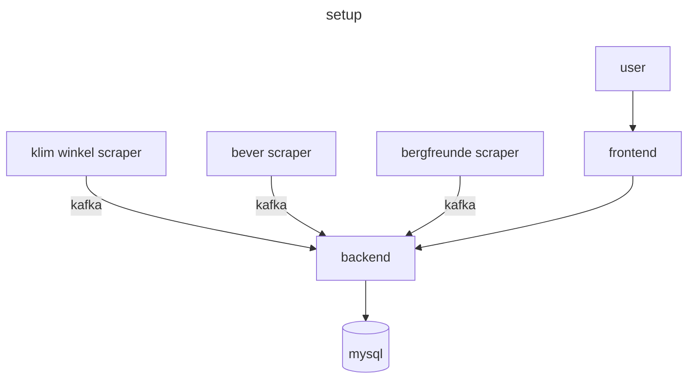

## camscraper
a scraper to find the cheapest climbing cams

## structure
The scraper works with multible seprate scrapers which send data to the api via apache kafka. I a diagram this would look like this:

