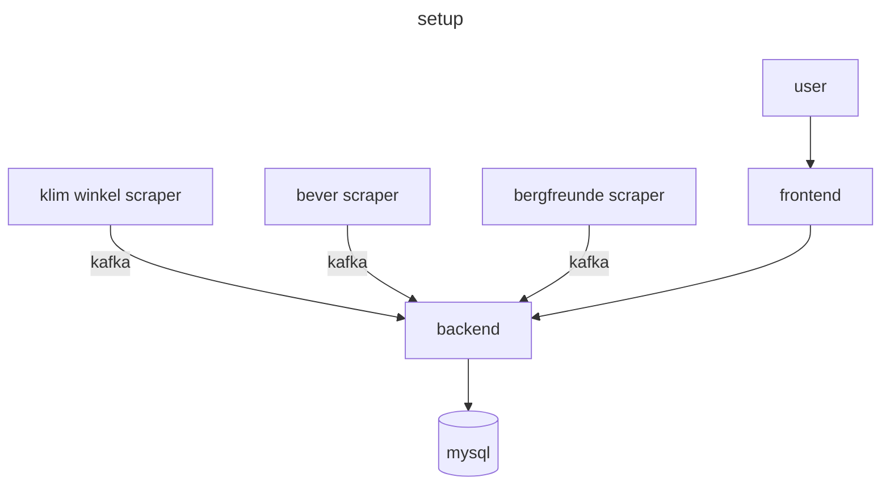
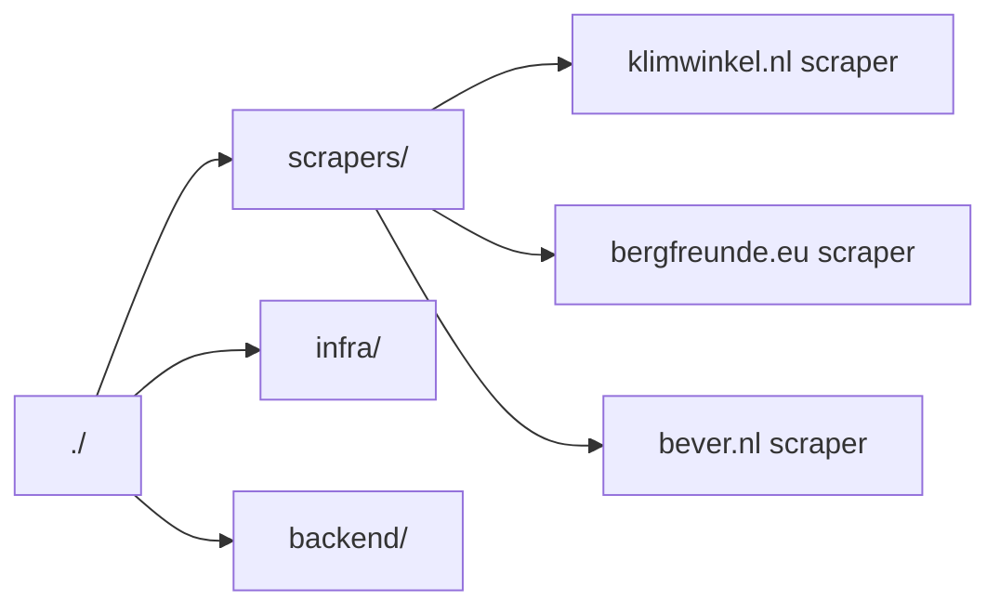

## camscraper
a scraper to find the cheapest climbing cams in the same fashion as [diskprices.com](https://diskprices.com/). we will use the following attributes:
- price 
- amount
- weight
- manafacture product number(mpn)
- link to shop

extra data about the cam is manually added and joined by mpn

## structure
The scraper works with multible seprate scrapers which send data to the api via apache kafka. I a diagram this would look like this:

### folder structure
The folder structure for this project is the following:

## setting up
The repo has multible micro services each doing something diffrent

to start the kafka nodes run:
`make run_infra`

to start the scrapers run:
`make run_scrape`

to start the api/frontend run:
`make run_site`

## todos
- [ ] setup kafka on docker compose and add it to makefile
- [ ] setup scrapers on docker and add it to make file
- [ ] setup api/fe and add to docker and makefile
- [ ] setup logging
- [x] setup docker for scrapers